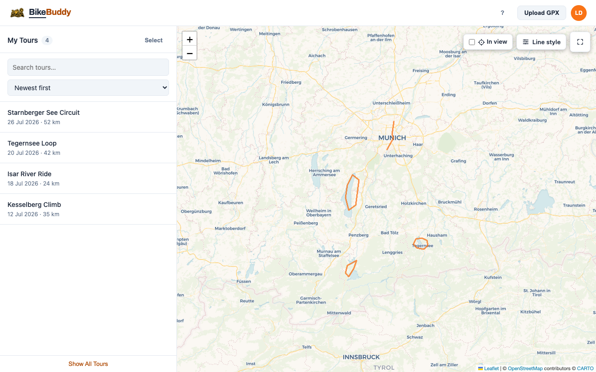

# BikeBuddy

BikeBuddy – Your ride, your routes, your memories. Upload GPX tours from any ride (cycling or motorcycling), visualize them as routes on the map, and attach photos.

**Stack**
[](https://github.com/nobuddyorg/BikeBuddy/blob/main/functions/package.json)
[](https://github.com/nobuddyorg/BikeBuddy/blob/main/docs/reference/architecture.md)
[](https://github.com/nobuddyorg/BikeBuddy/blob/main/docs/reference/architecture.md)
[](https://github.com/nobuddyorg/BikeBuddy/blob/main/docs/how-to/infrastructure.md)
[](https://github.com/nobuddyorg/BikeBuddy/blob/main/infrastructure)

**Lint & format**
[](https://github.com/nobuddyorg/BikeBuddy/blob/main/functions/eslint.config.js)
[](https://github.com/nobuddyorg/BikeBuddy/blob/main/functions/.prettierrc.json)
[](https://github.com/nobuddyorg/BikeBuddy/blob/main/functions/eslint.config.js)
[](https://github.com/nobuddyorg/BikeBuddy/blob/main/functions/tsconfig.json)
[](https://github.com/nobuddyorg/BikeBuddy/blob/main/.markdownlint-cli2.jsonc)
[](https://github.com/nobuddyorg/BikeBuddy/blob/main/.typos.toml)
[](https://github.com/nobuddyorg/BikeBuddy/blob/main/.editorconfig)
[](https://github.com/nobuddyorg/BikeBuddy/blob/main/.pre-commit-config.yaml)
[](https://github.com/nobuddyorg/BikeBuddy/blob/main/.tflint.hcl)
[](https://github.com/nobuddyorg/BikeBuddy/blob/main/.pre-commit-config.yaml)

**Architecture**
[](https://github.com/nobuddyorg/BikeBuddy/blob/main/.dependency-cruiser.cjs)
[](https://github.com/nobuddyorg/BikeBuddy/blob/main/functions/knip.jsonc)

**Security**
[](https://github.com/nobuddyorg/BikeBuddy/blob/main/.gitleaks.toml)
[](https://github.com/nobuddyorg/BikeBuddy/blob/main/.github/zizmor.yml)
[![Opengrep](https://img.shields.io/badge/SAST-Opengrep-blue?logo=data%3Aimage%2Fsvg%2Bxml%3Bbase64%2CPHN2ZyB2aWV3Qm94PSI4MCA2MTAgNjIgNTciIHhtbG5zPSJodHRwOi8vd3d3LnczLm9yZy8yMDAwL3N2ZyIgZmlsbD0ibm9uZSI%2BPHBhdGggZD0iTTExNyA2MTguOUMxMTEuNCA2MjQuOSAxMTAuNiA2MzQuNSAxMTAuOSA2MzguNkg5OC4zQzk4LjggNjI2LjEgMTAzLjIgNjE5LjkgMTA1LjMgNjE4LjNDMTA2LjIgNjE3LjUgMTA4LjYgNjE2IDExMS4zIDYxNkMxMTQgNjE2IDExNi4yIDYxOCAxMTcgNjE4LjlaTTExNyA2MTguOUMxMjIuNSA2MjQuOSAxMjMuMyA2MzQuNSAxMjMuMSA2MzguNkgxMzUuNkMxMzUuMSA2MjYuMSAxMzAuOCA2MTkuOSAxMjguNyA2MTguM0MxMjcuOCA2MTcuNSAxMjUuNCA2MTYgMTIyLjYgNjE2QzExOS45IDYxNiAxMTcuNyA2MTggMTE3IDYxOC45Wk0xMDQuNyA2NTguM0M5OS4xIDY1Mi4zIDk4LjMgNjQyLjcgOTguNiA2MzguN0g4NkM4Ni41IDY1MS4xIDkwLjkgNjU3LjQgOTMgNjU4LjlDOTMuOSA2NTkuNyA5Ni4zIDY2MS4yIDk5IDY2MS4yQzEwMS43IDY2MS4yIDEwMy45IDY1OS4zIDEwNC43IDY1OC4zWk0xMDQuNyA2NTguM0MxMTAuMiA2NTIuMyAxMTEgNjQyLjcgMTEwLjggNjM4LjdIMTIzLjNDMTIyLjggNjUxLjEgMTE4LjUgNjU3LjQgMTE2LjQgNjU4LjlDMTE1LjUgNjU5LjcgMTEzIDY2MS4yIDExMC4zIDY2MS4yQzEwNy42IDY2MS4yIDEwNS40IDY1OS4zIDEwNC43IDY1OC4zWiIgc3Ryb2tlPSJ3aGl0ZSIgc3Ryb2tlLXdpZHRoPSIzLjUiLz48L3N2Zz4%3D)](https://github.com/nobuddyorg/BikeBuddy/security/code-scanning?query=tool%3A%22Opengrep+OSS%22)
[](https://github.com/nobuddyorg/BikeBuddy/security/code-scanning?query=tool%3ACodeQL)
[](https://github.com/nobuddyorg/BikeBuddy/security/code-scanning?query=tool%3ATrivy)
[](https://github.com/nobuddyorg/BikeBuddy/blob/main/.zap)
[](https://github.com/nobuddyorg/BikeBuddy/blob/main/.pre-commit-config.yaml)

**Tests**
[](https://github.com/nobuddyorg/BikeBuddy/blob/main/functions/vitest.config.js)
[](https://github.com/nobuddyorg/BikeBuddy/blob/main/e2e/playwright.config.ts)
[![Accessibility](https://img.shields.io/badge/a11y-axe--core-663399?logo=data%3Aimage%2Fsvg%2Bxml%3Bbase64%2CPHN2ZyB4bWxucz0iaHR0cDovL3d3dy53My5vcmcvMjAwMC9zdmciIHZpZXdCb3g9IjAgMCA1MTIgNTEyIj48IS0tISBGb250IEF3ZXNvbWUgRnJlZSA2LjcuMiBieSBAZm9udGF3ZXNvbWUgLSBodHRwczovL2ZvbnRhd2Vzb21lLmNvbSBMaWNlbnNlIC0gaHR0cHM6Ly9mb250YXdlc29tZS5jb20vbGljZW5zZS9mcmVlIChJY29uczogQ0MgQlkgNC4wLCBGb250czogU0lMIE9GTCAxLjEsIENvZGU6IE1JVCBMaWNlbnNlKSBDb3B5cmlnaHQgMjAyNCBGb250aWNvbnMsIEluYy4gLS0%2BPHBhdGggZmlsbD0iI2ZmZmZmZiIgZD0iTTAgMjU2YTI1NiAyNTYgMCAxIDEgNTEyIDBBMjU2IDI1NiAwIDEgMSAwIDI1NnptMTYxLjUtODYuMWMtMTIuMi01LjItMjYuMyAuNC0zMS41IDEyLjZzLjQgMjYuMyAxMi42IDMxLjVsMTEuOSA1LjFjMTcuMyA3LjQgMzUuMiAxMi45IDUzLjYgMTYuM2wwIDUwLjFjMCA0LjMtLjcgOC42LTIuMSAxMi42bC0yOC43IDg2LjFjLTQuMiAxMi42IDIuNiAyNi4yIDE1LjIgMzAuNHMyNi4yLTIuNiAzMC40LTE1LjJsMjQuNC03My4yYzEuMy0zLjggNC44LTYuNCA4LjgtNi40czcuNiAyLjYgOC44IDYuNGwyNC40IDczLjJjNC4yIDEyLjYgMTcuOCAxOS40IDMwLjQgMTUuMnMxOS40LTE3LjggMTUuMi0zMC40bC0yOC43LTg2LjFjLTEuNC00LjEtMi4xLTguMy0yLjEtMTIuNmwwLTUwLjFjMTguNC0zLjUgMzYuMy04LjkgNTMuNi0xNi4zbDExLjktNS4xYzEyLjItNS4yIDE3LjgtMTkuMyAxMi42LTMxLjVzLTE5LjMtMTcuOC0zMS41LTEyLjZMMzM4LjcgMTc1Yy0yNi4xIDExLjItNTQuMiAxNy04Mi43IDE3cy01Ni41LTUuOC04Mi43LTE3bC0xMS45LTUuMXpNMjU2IDE2MGE0MCA0MCAwIDEgMCAwLTgwIDQwIDQwIDAgMSAwIDAgODB6Ii8%2BPC9zdmc%2B)](https://github.com/nobuddyorg/BikeBuddy/blob/main/e2e/axe.ts)
[](https://github.com/nobuddyorg/BikeBuddy/blob/main/functions/test/fast-check.setup.js)
[](https://codecov.io/gh/nobuddyorg/BikeBuddy)
[](https://dashboard.stryker-mutator.io/reports/github.com/nobuddyorg/BikeBuddy/main)

**Performance**
[](https://github.com/nobuddyorg/BikeBuddy/blob/main/e2e/lighthouse)
[](https://github.com/nobuddyorg/BikeBuddy/actions/workflows/k6-load-test.yml)

**Status**
[](https://github.com/nobuddyorg/BikeBuddy/actions/workflows/gate.yml)
[](https://github.com/nobuddyorg/BikeBuddy/actions/workflows/deploy.yml)
[](https://github.com/nobuddyorg/BikeBuddy/commits/main)
[](LICENSE)

## Quickstart

All helper scripts run through a single entry point, `./buddy.sh <group> <command>`
(`./buddy.sh --help` lists everything):

```bash
./buddy.sh development setup       # one-time: install tools + config templates (Docker must be running)
./buddy.sh development start-all   # start the full local stack → http://localhost:4280
```

## Documentation

Full docs live in [`docs/`](docs/README.md), organised by [Diátaxis](https://diataxis.fr):

- **Tutorial** — [Getting started](docs/tutorials/getting-started.md)
- **How-to** — [User guide](docs/how-to/user-guide.md) · [Developer guide](docs/how-to/developer-guide.md) (local dev, auth/tokens, deploy) · [Load testing](docs/how-to/load-testing.md)
- **Reference** — [Architecture](docs/reference/architecture.md) · [Configuration](docs/reference/configuration.md)
- **Explanation** — [Design decisions](docs/explanation/design-decisions.md) · [Cost report](docs/cost-report.md)

Infrastructure details: [Infrastructure how-to](docs/how-to/infrastructure.md). Contributor conventions: [Contributing guide](CONTRIBUTING.md).

## Screenshot



## Technology map

<p align="center">
  
  &nbsp;&nbsp;&nbsp;
  
  &nbsp;&nbsp;&nbsp;
  
  &nbsp;&nbsp;&nbsp;
  
  &nbsp;&nbsp;&nbsp;
  
  &nbsp;&nbsp;&nbsp;
  
  &nbsp;&nbsp;&nbsp;
  
  &nbsp;&nbsp;&nbsp;
  
  &nbsp;&nbsp;&nbsp;
  
  &nbsp;&nbsp;&nbsp;
  
  &nbsp;&nbsp;&nbsp;
  
  &nbsp;&nbsp;&nbsp;
  
  &nbsp;&nbsp;&nbsp;
  
  &nbsp;&nbsp;&nbsp;
  
  &nbsp;&nbsp;&nbsp;
  
  &nbsp;&nbsp;&nbsp;
  
  &nbsp;&nbsp;&nbsp;
  
  &nbsp;&nbsp;&nbsp;
  
  &nbsp;&nbsp;&nbsp;
  
  &nbsp;&nbsp;&nbsp;
  
  &nbsp;&nbsp;&nbsp;
  
</p>
