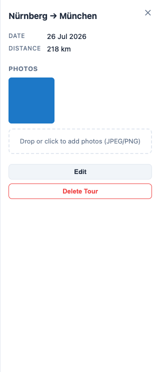

# How-to: Use BikeBuddy

Short, task-focused recipes. There's also an in-app **?** button (top right) with
a quick version of this.

## Sign in

Click **Sign In**. Signing in saves your tours to your account. (Locally the app
auto-signs-in as a dev user.)

## Your account

Click your avatar (top right) to open your account. From there you can set a
display name, switch the UI language, export your data, or delete your account
and all its data.

## Upload a tour

1. Click **Upload GPX**.
2. Enter a name (defaults to the file name) and an optional description.
3. Drop or choose a `.gpx` file (max 10 MB) and click **Upload**.

The tour appears in the sidebar and on the map; the view jumps to its heatmap.

## Find a tour

- **Search**: type in the sidebar search box — fuzzy matching on the tour name.
- **Sort**: use the dropdown — by date, name, or length, ascending or descending.

## Read the map

- The heatmap shows where you've ridden; warmer colours = more passes.
- Click a tour to focus it; **Show All Tours** restores the combined heatmap.
- Toggle **In view** (top right of the map) to show only the tours visible in
  the current map view — useful once you have tours from many different places
  and want the sidebar list to match what you're looking at.

## Photos

1. Open a tour (click it) to reveal the detail panel.
2. Drop or choose JPEG/PNG photos to attach them.
3. Click a thumbnail to view it full-size; the ✕ deletes it.

## Photo pins

Toggle **Photo pins** (top right of the map, next to **In view**) to show
geotagged photos where they were taken. Photos taken at the same spot fan out
so each is clickable. Default off.

## Edit or delete a tour

Open a tour, then use **Edit** (name/description) or **Delete Tour** in the
detail panel.

## Select and delete multiple tours

Click **Select** in the sidebar to enter selection mode, check off the tours you
want to remove, then click **Delete** in the selection bar to remove them all at
once. **Cancel** exits selection mode without deleting anything.
